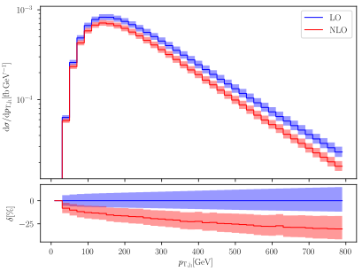

Project Description
===================

``hep-mc`` is a C++11 template library for `Monte Carlo integration
<https://en.wikipedia.org/wiki/Monte_Carlo_integration>`_. The following
integration algorithms are available:

- PLAIN,
- VEGAS [1]_ [2]_, and a
- MULTI CHANNEL integrator with adaptive weight optimization [3]_.

Features
========

- **Parallelization**: For each integrator a function prefixed with ``mpi_`` is
  available that uses the `Message Passing Interface (MPI)
  <http://www.mpi-forum.org/>`_ to run the integration in parallel (locally or
  on a cluster). The parallel integration is designed in such a way that it
  returns the numerically same result as its non-parallel counterpart. In
  particular this means that the result is independent from the number of
  processors used and only dependent on the seed of the random number generator.
- **Distributions**: Arbitrary many differential distributions can be generated
  during the integration.
- **Intermediate results**: Callback functions can be used to print intermediate
  results as soon as they are available. After the integration is finished each
  intermediate result can be extracted separately if the automatically weighted
  average does not suit the user.
- **Random numbers**: Random numbers are generated using the C++ standard
  library `random <http://en.cppreference.com/w/cpp/numeric/random>`_. This
  library offers many random number generators from which the user can choose.
  If no random number generator is explicitly requested a Mersennne twister
  (MT19937) is used.
- **Numeric Types**: All functions are templates in order to support all
  floating point types of C++, i.e. ``float``, ``double``, and ``long double``.
  Kahan summation is used to prevent loss of numerical accuracy in long-running
  integrations.

Showcase
========

The following (LO) differential distribution was generated using the MULTI
CHANNEL integrator from ``hep-mc`` running with 200 processors on the `NEMO
cluster <https://www.hpc.uni-freiburg.de/nemo>`_ for about 30 hours, for 50
iterations each calling the integrand 1'000'000'000 times. The plot itself was
generated with `matplotlib <https://matplotlib.org/>`_

The integrands are matrix elements from `OpenLoops
<https://openloops.hepforge.org/>`_ describing the scattering of W- and
Z-bosons. The generated distribution describes the transverse momentum of the
leading jet.

Usage
=====

This library uses features from the ISO C++11 standard which must be enabled
with your compiler. For the GCC and clang compilers this can be done by passing
an additional parameter to the compiler, e.g. ::

    g++ -std=c++11 my_program.cpp

The inclusion of the main header, ::

    #include <hep/mc.hpp>

is sufficient to use it; you do not need to link against a library. If you
intend to use the MPI variants of the integrators include ::

    #include <hep/mc-mpi.hpp>

instead. To see the library in action take a look at the example programs in the
`examples directory`_.

Documentation and Examples
==========================

Documentation is available online at http://cschwan.github.io/hep-mc and can be
generated from sources (see Installation_). The examples can be viewed from
within the documentation.

Installation
============

The easiest way to use this library is to just download it from the `releases
page`_ and point your compiler to the `include directory`_ - there is no library
that needs to be compiled.

If you want to automatically compile the example programs, generate the
documentation, and/or install the headers you have to use
`meson <http://mesonbuild.com/>`_ to build ``hep-mc``. If you have meson
installed simply type ::

    meson build
    cd build

to generate the build files in ``build`` and to enter the generated directory.
To enable building the examples, type ::

    meson configure -Dexamples=true

in the build directory. To enable examples and tests relying on MPI type ::

    meson configure -Dmpi=true

The `Doxygen <http://doxygen.org/>`_ documentation can be enabled with ::

    meson configure -Ddoxygen=true

Further options can be viewed by typing ::

    meson configure

which will display all options (including install paths) that can be altered by
using the ``-Doption-name=value`` shown above. ::

To finally build everything type ::

    ninja

and/or ::

    ninja install

to install the headers.

References
==========

.. [1] G. P. Lepage. "A New Algorithm for Adaptive Multidimensional
       Integration". J. of Comp. Phys. 27 (1978), pp. 192-203. DOI:
       `10.1016/0021-9991(78)90004-9
       <http://dx.doi.org/10.1016/0021-9991(78)90004-9>`_.

.. [2] G.P. Lepage. "VEGAS: An Adaptive Multi-dimensional Integration Program".
       Cornell preprint CLNS 80-447 (1980).

.. [3] R. Kleiss, R. Pittau. "Weight optimization in multichannel Monte Carlo".
       Comp. Phys. Commun. 83 (1994), pp. 141-146. DOI:
       `10.1016/0010-4655(94)90043-4
       <http://dx.doi.org/10.1016/0010-4655(94)90043-4>`_. arXiv:
       `hep-ph/9405257 <http://arxiv.org/abs/hep-ph/9405257>`_.

.. _releases page: http://github.com/cschwan/hep-mc/releases
.. _include directory: http://github.com/cschwan/hep-mc/tree/master/include
.. _examples directory: http://github.com/cschwan/hep-mc/tree/master/examples
